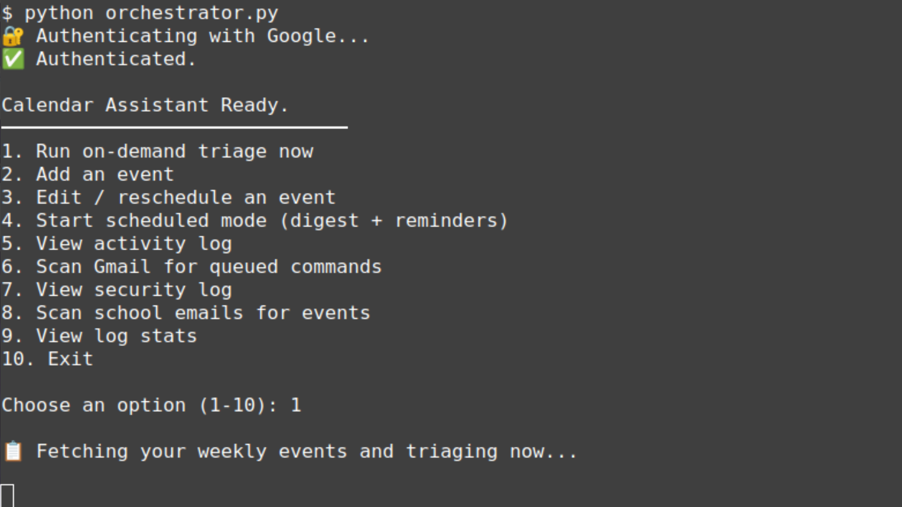

# 📅 Calendar Assistant

A privacy-first, AI-powered personal calendar assistant that runs entirely on your own machine. No cloud AI subscriptions. No data leaving your system. Just a local language model doing the thinking — connected to your Google Calendar and Gmail.

---



---

## What It Does

Calendar Assistant is a Python-based tool that acts as a smart layer on top of Google Calendar. Instead of passively storing your events, it actively reads them, reasons about them, and helps you stay on top of what matters.

Here's what it can do:

- **Triage your week** — runs your upcoming events through a local AI model that scores each one by urgency and priority (URGENT / IMPORTANT / ROUTINE), so you always know what needs your attention first
- **Add events in plain English** — type something like *"gym Saturday at 2pm"* and it handles the rest, no form-filling required
- **Edit and reschedule** — ask it to move or update an existing event; it confirms with you before touching anything
- **Daily digest emails** — sends a morning summary of your day directly to your Gmail, formatted and prioritized
- **30-minute reminders** — fires an email reminder before every event so nothing catches you off guard
- **Scan Gmail for commands** — email yourself a command like `ADD: dentist Monday 3pm` and the assistant picks it up and acts on it automatically
- **Scan school emails for events** — parses academic emails and extracts deadlines or scheduled events to add to your calendar
- **Activity and security logs** — tracks everything the assistant touches so you always have a record

---

## How the AI Works (No Cloud Required)

This project uses **Ollama** to run open-source language models locally — meaning the AI runs on your own CPU or GPU, not a server somewhere else.

Two models handle different jobs:

| Model | Role |
|---|---|
| `mistral:7b-instruct` | Triage, nudges, reasoning — the "thinking" tasks |
| `gemma2:2b` | Event parsing, add/edit — fast, lightweight tasks |

**Why two models?** Mistral is smarter but slower, so it's reserved for analysis. Gemma2 is lean and quick, which makes adding or editing an event feel instant. The assistant routes each task to the right model automatically.

Python as a safety net — even the best language models can fumble dates and times. If Gemma2 returns something ambiguous or malformed, Python's native datetime parsing steps in to normalize and validate it before anything gets written to your calendar. The two work together: the model does the natural language understanding, Python enforces the correctness. Nothing gets added with a broken timestamp.
Your calendar data never leaves your machine. No OpenAI key, no Anthropic key, no API costs.

---

## Google Integrations

The assistant connects to two Google services using OAuth 2.0 (your own credentials, set up once):

**Google Calendar**
- Reads your upcoming events across any calendars in your account
- Creates, edits, and deletes events on your behalf
- Supports iCal feed imports (e.g. a school or work Outlook calendar synced in)

**Gmail**
- Sends your morning digest and event reminders to your inbox
- Scans your inbox for email commands you send yourself
- Parses academic or work emails for embedded event details

---

## Triage Logic

When you run a triage, the assistant fetches your next 7 days of events and sends each one through the Mistral model with a structured prompt. The model evaluates the event based on its title, time, and context, then assigns one of three labels:

- 🔴 **URGENT** — time-sensitive, high consequence if missed
- 🟡 **IMPORTANT** — matters, but some flexibility
- 🟢 **ROUTINE** — low stakes, informational

The results are printed in the terminal and can be emailed as your daily digest.

---

## Scheduled Mode

Running in scheduled mode starts a background loop that:

1. Sends your morning digest at a configured time (default 7:45 AM)
2. Checks for upcoming events every few minutes and fires reminders at the 30-minute mark
3. Periodically scans Gmail for any commands you've emailed yourself

This can be set up as a system service (Linux: `systemd`, Windows: Task Scheduler) so it runs automatically on startup without needing a terminal open.

---

## Requirements

- Python 3.10+
- [Ollama](https://ollama.com) installed and running locally
- A Google Cloud project with Calendar and Gmail APIs enabled
- `credentials.json` from your Google Cloud Console (OAuth 2.0 desktop app)

---

## Setup

```bash
git clone https://github.com/yourusername/calendar-assistant.git
cd calendar-assistant
python -m venv venv
source venv/bin/activate  # Windows: venv\Scripts\activate
pip install -r requirements.txt
```

Pull the AI models:

```bash
ollama pull mistral:7b-instruct-q4_0
ollama pull gemma2:2b
```

Add your `credentials.json` to the project folder (not included — see Google Cloud Console), then run:

```bash
python orchestrator.py
```

A browser window will open on first run to authorize Google access. After that, everything runs locally.

---

## Security Notes

- `credentials.json` and `token.json` are listed in `.gitignore` and should **never** be committed
- The assistant confirms all edits and deletions with you before making changes
- A security log tracks all sensitive actions

---

## Project Structure

```
calendar-assistant/
├── orchestrator.py       # Core logic — triage, scheduling, event management
├── gmail_trigger.py      # Gmail scanning and email command processing
├── web_ui.py             # Optional PIN-protected mobile web interface
├── nudge_engine.py       # Reminder and nudge scheduling
├── start_assistant.py    # Service entry point for background/startup mode
├── requirements.txt      # Python dependencies
├── .gitignore            # Keeps credentials off GitHub
└── activity_log.json     # Auto-generated runtime log (not committed)
```

---

## Built With

- [Ollama](https://ollama.com) — local LLM runtime
- [Mistral 7B Instruct](https://mistral.ai) — primary reasoning model
- [Gemma 2 2B](https://ai.google.dev/gemma) — fast parsing model
- Google Calendar API
- Gmail API
- Python `schedule` library for timed jobs
- Flask (optional web UI)

---

*Built as a personal productivity tool. All AI inference runs locally — your data stays yours.*

*Repository maintained by [@prof-a86](https://github.com/prof-a86)*
